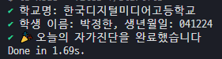

# Selfcheck-V2
리뉴얼된 자가진단을 자동화해봅시다🎉 **본인의 건강상태에 이상이 없음을 확인했을 때에만 본 프로그램을 사용해주세요. 본 프로그램을 사용함으로써 당신이 받게 되는 불이익에 대해 책임을 지지 않습니다.**

# 사용 방법
## 설치
```bash
git clone https://github.com/rycont/nodejs-selfcheck-automation-v2
cd ./nodejs-selfcheck-automation-v2
# yarn
yarn
# npm
npm install
```
## 자가진단 정보 입력
`.env`파일을 만드시고, `.env.example`에 따라서 적당하게 정보를 채워넣어주세요. 올바르지 않은 정보가 입력되었을시에는 프로그램이 종료될 수 있습니다.

## 실행
```bash
# yarn
yarn run test
# npm
npm run test
```


# Contributors
[RyCont](https://github.com/rycont)